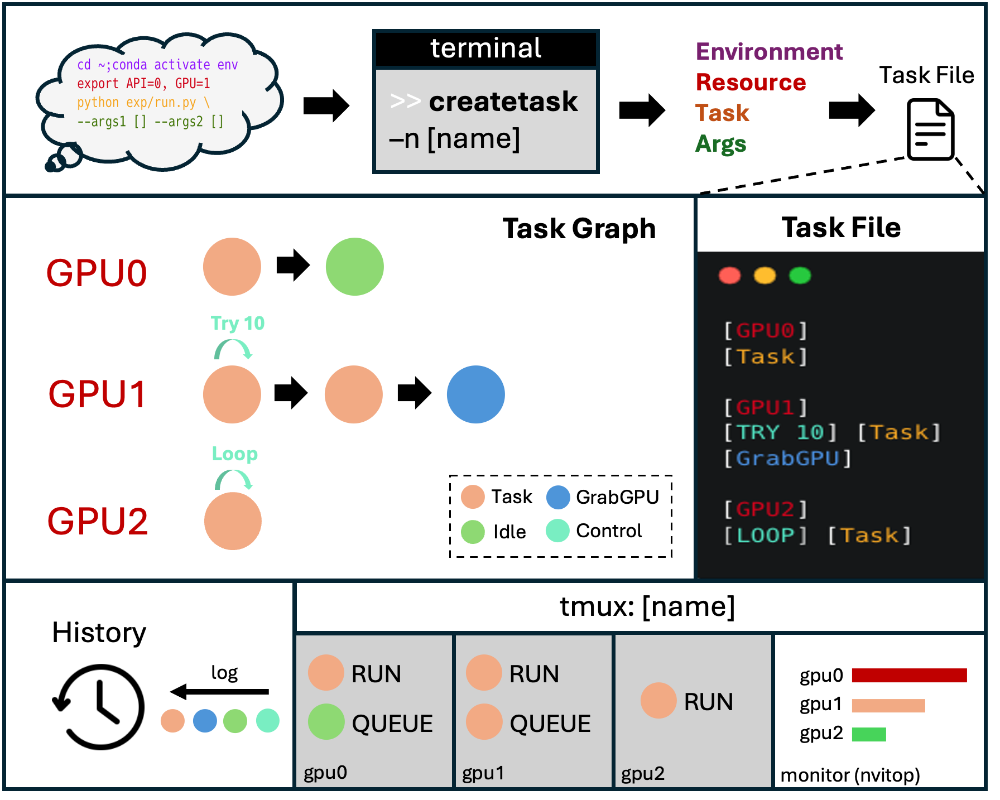

# zutils

## Job System

Inspired by the concept of **SIMD** (Single Instruction Multiple Data), we developed a streamlined job system to accelerate daily research tasks such as **Ablation Studies** and **Data Processing**.



### Abstraction of a "Job"

We define a job using four core elements:

- **Environment**: The working directory, Conda environment, and other necessary setups.
- **Resources**: Allocated assets, such as GPUs or APIs.
- **Tasks**: The scripts or executables to be executed.
- **Args**: Command-line arguments passed to tasks.

### Core Implementation

The job system's core consists of two main components: the **Taskfile** and the **Task Scheduler**.

- **Taskfile**: Central to structuring tasks. It uses a straightforward format to define environments, resources, tasks, and arguments. For example:
    ```
    [Environment]
    [GPU0][Task][Args]
    [GPU1][TRY 10][Task][Args]
    [GPU2][LOOP][Task][Args]
    ```

- **Task Scheduler**: Serves as a bridge between the terminal, Python, and tmux. It reads the taskfile and creates a tmux session to run tasks. Key features include:
  - **Retry Mechanism**: Automatically retries failed tasks a specified number of times.
  - **Parallel Task Execution**: Allows concurrent task execution on the same resource.
  - **Ordered Execution**: Ensures tasks are executed in a predefined order.
  - **Idle Resource Management**: Monitors GPU state to optimize resource usage.

### Workflow Management

We provide three terminal commands to interact with the job system:

- `createtask [name]` – Creates a new task.
- `checktask [name]` – Monitors the status of a task.
- `killtask [name]` – Terminates a running task.

## File System

## Plot System
